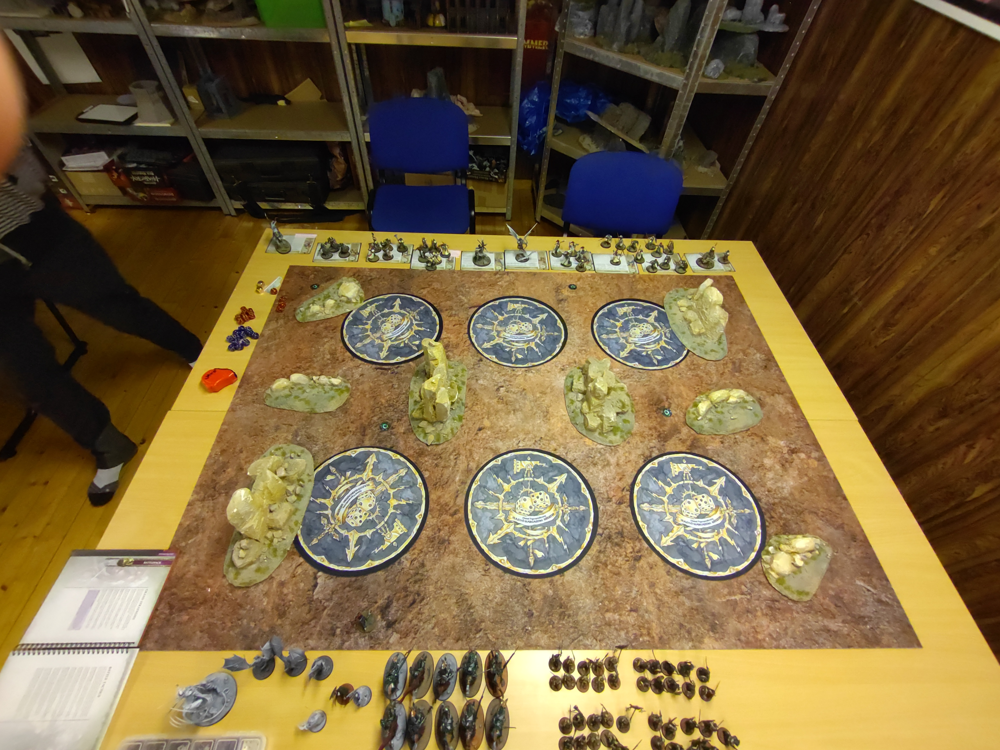

# SBG vs SCE

## Mission

GBH 2022 S1
Close to the Chest

Deployment: L &#8514; med 9" dead man zone till gränsen.

### Resultat
Vinst
26 - 25

## Terräng

I bilden ovan så är min deployment den som har mest yta nederst i bild.

Jag byggde terrängen. Tanken vart att ha lite line of sight blockering för att SCE inte skulle kunna välja mål helt fritt med sin shooting:
* Celestar Ballista
* Castigators (Reinforced x1)
* Yndrasta

Terrägen vart mer eller mindre symetrisk, då jag ville kunna gömma min Vengorian Lord i den utstickande delen av deploymenten. Det känndes som att terrängen hjälpte mig i matchen istället för att vara ivägen som det kännts tidigare.

## Gravesites

Betydligt bättre gravesite placering. Det enda är att jag nog vart lite för agressiv med de 2 i min egen zone. Skulle haft dem lite längre bak så jag hade kunnat droppa i min egen zon. Men så otroligt mycket bättre att inte lägga dem på ett objective, vart ju ett helt annat spel när man inte kan blockera en gravesite med en enhet och samtidigt så och hålla ett objective. Just i denna deployment av gravesites så tappade jag ganska mycket av min 12" bubbla off board på mina 2 offensiva gravesites. Men kännde ändå att de gjorde något, men bör lägga dem lite längre in på bordet för att få in auran längre.

## Deployment

**På bordet**

* Blood Knights (Bounty Hunters)
* Wight King
* 2x Necromancers
* Vengorian Lord
* Vampire Lord
* 2x Skelett
* Dire Wolves

**I graven**
* Grave Guard 2h (Bounty Hunters)
* Grave Guard 1h+Shield (Bounty Hunters)
* 2x Skelett (Expert Conquereors)
* Fel Bats

Bättre deployment, använde mina 2 skelett enheter som inte är Expert Conquereors för att hålla de 2 objektiven helt i min deployment zone hela matchen. Det kännde som att de verkligen gjorde nytta där, gjorde att jag kunde vara mycket mer offensiv med mina andra trupper då jag visste att jag hade saker att hålla dem. Vengorian Lord deployad offensivt vart en  bra distraction carnifex.

## Battle

Fick botten av tur 1 och mina blood knights vart ganska hårt ansatta av shooting. Men de tankade den ganska bra med AoD, 
förlorade totalt 4 Knights till all shooting. SCE droppade en heldel enheter offensivt mot objektivet i nedre vänstra hörnet. Men fick av Mystic Shield på Blood Knights och sen gick de och städade bort en enhet Sequitors (GVs), bara riders fick igenom 21 dmg och de klarade inte nog med +++5 för att överleva. Sen i tur 2 så chargeade en enhet Vindictors (GVs) men min Vengorian Lord vart en lysande distraction carnifex så mina Blood Knigts fick så först och åter igen briljerade de. Blood Knights vart MVP denna matchen. De dödade 4st enheter. Jag struntade i att fokusera Yndrasta vilket känndes helt rätt. Krävs väldigt mycket skada för att döda hjältar med Jobbigt att döda saker med en 3+ och sen 4+++. Försökte lite i slutet men de gick inte. Klantade jag min med mina Dire Wolves och missade helt coherency så tappade 3st vargar helt i onödan. Hade en plan att förska snylta in på alpha objectivet men de vart en total waste av dire wolves. 

Droppsen från gravesites gick bättre, första rundan så använde jag mina 2 skelett enheter för att klara Barge Through Enemy Lines med bonus poäng. Dock droppade jag mina 1h+shield grave guards för tidigt. Skulle väntat till runda 2 eller till och med runda 3 alternaitvt att jag skulle haft en gravesite bättre placerad så jag kunde droppat dem i mitt choken. Men i runda 4 så fick jag av en long charge in i GVs. 

Sen i runda 3 och 4 rollade jag den 5+ som då krävdes för att lyckas med Endless Legions (en Summonable enhet tillbaka i halv styrka), hade +1 på rollen vid båda tillfällena. Det gav mig objectives i battleshock och gav mig hold more båda gångerna!

Soulblight Battle Tacticen Callous Overlords är ju helt fantastisk att ha i bakfickan.

## Listan

### Behålla

#### Grave Guards 2h
Deployade dem lite fel denna matchen, och sen bommade jag chargen. Men tillslut kom de in i combat med en Knight-Incantor som lyckades med fler 3+ saves än vad som borde vara möjligt och överlevde på 1W. Sen vart de mördade av Yndrasta.

#### Blood Knights
MVP denna matchen utan tvekan, behöver verkligen fler! Riktigt effektiva Bounty Hunters och en bra distraction carnifex. 

#### Vengorian Lord
I denna matchen gjorde han en fantastisk insats som distraction carnifex. Gjorde inte så mycket skada, underskattade grovt hur tankiga Evocators är. 

#### Skelett
Alla skelett gjorde bra i från sig denna matchen, både Expert Conquerors och de i Vanguard. Sen om de i Vanguard verkligen är värda sina 2x80pts vet jag inte, men känns som att jag har hittat ett användningsområde

#### Fel Bats
Droppade dem lite fel denna matchen, men känner fortfarande att en enhet för 75pts med 14" move är ett bra verktyg i lådan.

#### Vampire Lord
Många viktiga unbinds i denna matchen. Vart inte många viktiga spells som inte vart unbound med +2 och re-roll! Samt bra Mystic Shield bot till mina Blood Knigts! Bytte artifact från den som är en andra chans att på 5+ unbinda en spell till den som ger +1 till save rolls. Vart riktigt bra att alltid ha AoD/Best Day Ever, räddade många saves samt att med Best Day Ever/AoD så är det en ganska bra save stack. 

### Byta ut

#### Grave Guards 1h + Shield
I denna matchen så vart deras performance till stor del mitt fel då jag droppade dem långt bort i skogen. Men de fick döda något denna matchen! Men tidigare analys om att de inte riktigt är värda 140pts då skölden inte ändrar saven på warscrollen utan bara ger +1 save.

#### Necromancers
I denna matchen så hade jag verkligen nytta av 2 extra unbinds samt att jag fick av ett par Invigorating Aura casts och hela en enhet skelett från 3 kvar till fullt med 2 casts + Deathly Invocation. Men 250pts är inte långt ifrån att få Manfred eller Neferata istället!

#### Dire Wolves
Deras performance i denna matchen vart mest mitt eget fel. Men enheten tar för stor plats för att effektivt kunna droppas från gravesites. Samt att de tål för lite när det finns bounty hunters i varenda buske. Behöver jag en screen så är Black Knights bättre för de är inte GVs.

#### Wight King
Ytterliggare en match där han mest gick runt och såg cool ut

#### Skelett
Inte fullt lika säker på att jag vill ta bort 2st skelett enheter... men får sova på saken