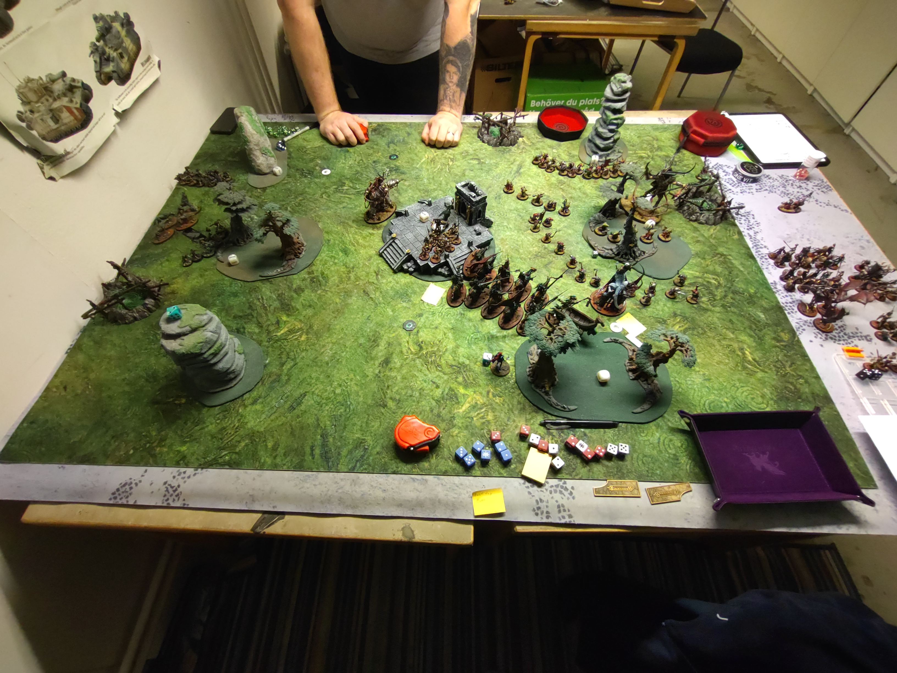

# SBG vs Skaven

## Mission

GBH 2022 S1
In the Presence of Idols

### Resultat
Förlust
24 - 28

## Terräng

Bra terräng, inget som vart super mycket ivägen.

## Gravesites

Vart en hyfsad placering av gravesites. Den mer i mitten av brädet vart nästan helt perfekt. Kanske att den skulle vart precis på gränsen på mitt territorie istället för att vara någon tum bakåt. Den uppe vid skogen (som vargarna eller råttorna står på i bilden ovan) vart lite malplacerad. Vet inte riktigt vad jag skulle upp dit och göra. Hade jag placerat den mer i mitten och iofs överlappat grave sites i min zon, men då hade de täckt upp mer av no-mans land och gjort det lite jobbigare att screena då jag hade kunnat flytta den andra lite mer mot berget i hörnet uppe till vänster. 
Den som är placerad i finde drop zone vet jag inte, visst den höll 20st clanrats där hela spelet mer eller mindre. Men vet inte riktigt om de vart värt de.. Något att fundera på.

## Deployment

Ganska nöjd med deployment, vart inte någon range på motståndar sidan så kunde ställa upp ganska offensivt. Min Wight King gjorde lite nytta och låste Gnaw Holet i min deployment zone. Vart nog hans bästa drag hittils! Han behövde inte traska runt med sina 4" move! Skulle ha deployat vargarna på ett annat ställe. Nu höll de 10st gutter runners upptagna hela matchen, kanske vart bra. 

## Battle

Fick en bra start, första rundan gick ganska fort med full score. Men sen valde jag 'Gaining Momentum' men jag räknade lite galet och missade att jag inte höll mer än motståndaren. Och min Vengorian Lord lyckades inte swinga så hårt att han rensade ut alla råttor. Så bommade en BT och det vart i slutet väldigt avgörnade. 
Jag ignorerade även de 2 stora monstren och Grey Seern som teleporterade runt. Vet inte riktigt vad syftet med allt teleporterande vart, inte en chans att jag tar mina sega enheter och springer ner i ett hörn. 

Behöver börja öva aktivt på tärningmatten, har svårt att avgöra om jag ens har en chans att döda något. Så blir ofta att jag ignorerar de enheterna istället för att chansa. 

Dropsen från graven vart mer on point nu, känns som att jag blir bättre på att utnyttja grave deployen. 

Tror jag failade alla rolls på Endless Legions utom ett, och de gav mig en BT. Alltid något

Vart iaf jävligt kul att spela mot Skaven och jag tror att det blir att bygga en egen hord ohyra!

## Listan

### Behålla

#### Grave Guards 2h
Alltid bra, blir att måla upp 20 till med 2h! De mördar oftast de de får tag i. Men de går inte att chargea en råttjävel som rollar 40 D6 och 1MW på 4+!

#### Blood Knights
Mosade massor av råttor! 60 clan rats fick bita i de sura. Alltid MVP mer eller mindre

#### Vengorian Lord
Mobilt monster med en unbind, kan tanka ganska mycket mot rätt grejer. Men Vermin Lords är inte hans specialitet... råttjävel!

#### Skelett
Dessa är otroligt bra, funderar på att ha 3st och köra alla 3 i EQ och grave deploy. Bra objective capture och ganska enkla att få in på ett objective

#### Fel Bats
Gjorde inte jättemycket i denna matchen. Vart inte jättemycket dödande så kunde inte direkt hota något objective. 

#### Vampire Lord
Komma ihåg att utnyttja min command ability, bra liten enhet med +2 till cast och reroll. Perfekt för att kasta Mystic Shield på mina Blood Knigts och försöka unbinda/dispella något viktigt med +2 till unbind/dispell och reroll. Väldigt tankig med artefakten som ger +1 save så att det är en 2+ save utan buffar.

### Byta ut

#### Grave Guards 1h + Shield
De gjorde nytta i denna matchen, de dödade massa Plague Censer Bearers! Men fortfarande bättre med 2h vapen för de ska döda saker och inte tanka.

#### Necromancers
Känns inte som att de gör något, kan inte kasta Vanhels på blood knights och lägger jag alltid grave guardsen i graven så kan jag inte buffa dem heller, de är ju inte på bordet i hero phase och eftersom de är så långsamma så hinner de oftast inte i fatt till rundan efter heller. Så ta något annat tills jag kan se att jag kan använda dem till något. Men ska jag byta ut dem så behöver jag något med unbinds. Bra med 4st unbinds i listan.

#### Dire Wolves
GV:s är inte värt det. De dör direkt iom att de har så låg save och ward, jäkla bounty hunters! För 135pts får jag nästan 20 skelett eller en enhet black knigts och poäng över. RIP voffsar.

#### Wight King
Denna matchen gjorde han något vettigt, han stod och tittade argt på ett hål så att inga råttor smög upp och ställde till med ofog!