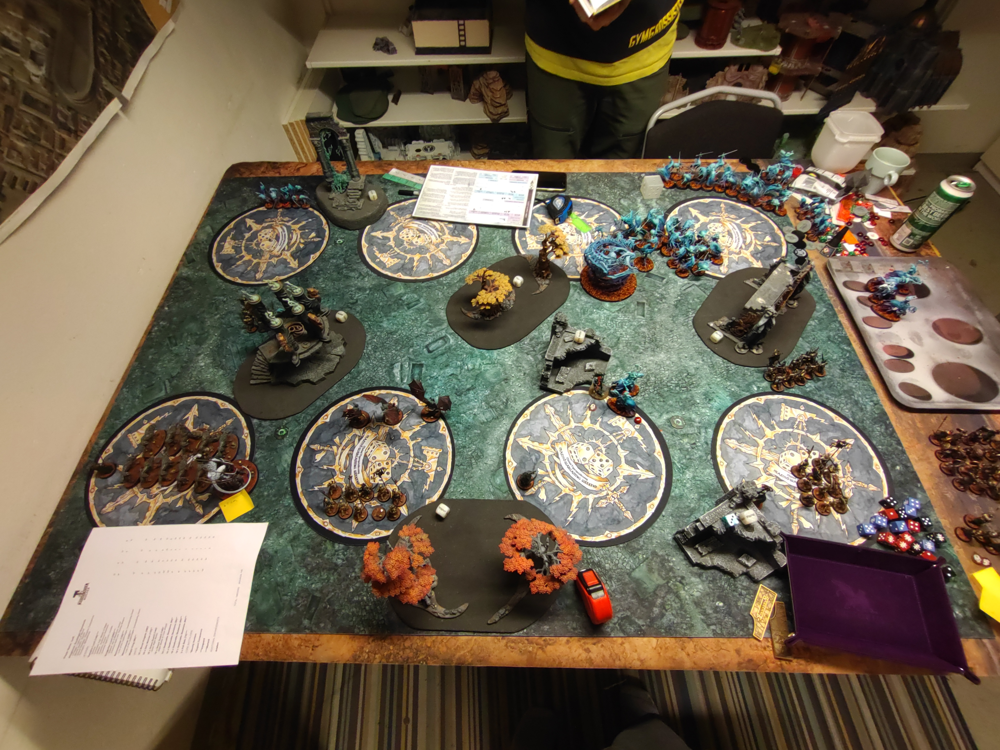

# SBG vs Nighthaunt

## Mission

GBH 2022 S1
The Silksteel Nests

### Resultat
Förlust
22 - 30

## Terräng

Bra terräng, inget som vart super mycket ivägen.

## Gravesites
Bra gravesite deployment de gjorde mycket nytta i denna matchen. Speciellt den uppe i vänstra hörnet. 

## Deployment
Min Wight King hamnade som vanligt fel... han gjorde inget alls denna matchen. Mer än att springa runt. Skulle ställt vargarna mer offensivt och försökt fått fram den mer. Skulle nog väntat med att deploya Blood Knigtsen och ställt dem mer i mitten istälelt för som nu mellan objectiven i mitt högra hörne. Detta för att de dem mer alterantiv. Gjorde en bra screen av min zon, så slapp massa irriterande Bladegheist Revenants i min backline. 

## Battle
Scorade 5pts i min första runda, men tänkte inte på att jag skulle sprängt objectivet uppe till höger. Det hade gjort stor skillnad senare, samt att jag hade haft ett point till. Sen skulle jag försökt göra detta med mina 1h + sheild grave guards för att för att offra mina blood knights för det. Vart en lika lång charge oavsett om jag använt blood knights eller droppat grave guards 9" i från. Att tappa dem runda 1 gjorde de ganska svårt att döda Bladegheists senare. Sen vart jag dumoffensiv med min general så hon dog ganska tidigt. Vilket gjorde att jag hade ont om command points och att han fick av sin -1 to Wound spell... då vart det ännujobbigare att döda Bladegheists... 

Sen fastnade min Vengorian Lord i Incarnaten och jag hade för lite dmg kvar för att kunna döda den. Så den gick upp till lv3.. Sen gjorde jag också en idiot redeploy som gav bort 2 objectives istället för ett. Skulle redeployat frammåt istället för backåt så han inte kunde chargea över mig och ta båda objectivena i vänstra hörnet. 

På andra sidan så gjorde ena av mina tv 10 skeletons i graven stor nytta. De tog massor med objectives och tvingade motståndaren att springa över halva slagfältet. Skulle dock sprängt objectiven snabbare så jag fick mer poäng och att de inte fanns några enkla objectives att ta för att få hold more. Fick ihop 22pts på 3 rundor och sen vart det 0 i runda 4 + 5. Så hade jag sprängt lite mer och inte kastat blood knigts i soptunnan så hade jag varit i en bättre position.

Man ska inte ge Nighthaunt mer debuffar än nödvändigt... speciellt inte på samma enhet. Incarnate är bra också... irriterande att man inte kan göra retreat.

## Listan

### Behålla

#### Grave Guards 2h
Alltid bra, blir att måla upp 20 till med 2h! De mördar oftast de de får tag i. De slaktade lite chainrasps och Hexwraiths

#### Blood Knights
I denna matchen så kastade jag bort dem helt, chargeade in och tänkte inte alls på Nighthaunts debuffar. Så de dödade 10 chainrasps och sen vart de borta...

#### Vengorian Lord
Han fastnade i en Incarnate och sen vart de de. 

#### Skelett
Dessa är otroligt bra, funderar på att ha 3st och köra alla 3 i EQ och grave deploy. Bra objective capture och ganska enkla att få in på ett objective

#### Fel Bats
De försökte döda lite Bladegheists, men de gick inte... sen blockade de en charge för mina Grave Guards också för att jag chargeade i fel ordning...

#### Vampire Lord
Komma ihåg att utnyttja min command ability, bra liten enhet med +2 till cast och reroll. Perfekt för att kasta Mystic Shield på mina Blood Knigts och försöka unbinda/dispella något viktigt med +2 till unbind/dispell och reroll. Väldigt tankig med artefakten som ger +1 save så att det är en 2+ save utan buffar. Tankade och dödade lite Hexwraiths, men sen dog jag på MW impact hits. En Master of Magic med +2 är galet bra!

### Byta ut

#### Grave Guards 1h + Shield
Droppade dem helt fel, så de vart bara en extra move för Bladegheists och sen dog de av MWs på chargen. Inte enhetens fel...

#### Necromancers
2 extra unbinds gör inte mycket nytta när motståndaren har en cast. Fick av en Arcane Bolt som inte gjorde något. Så som jag spelar så har jag ingen nytta av 250 pts Necromancers.

#### Dire Wolves
De hjälpte till att hålla objectives, men skulle deployat dem lite mer mot mitten, typ objectivet näst längst till vänster och sen försökt låsa upp saker. De är ganska tankiga mot MWs då det är 2W per hund.

#### Wight King
En usel deck chair sitter återigen...