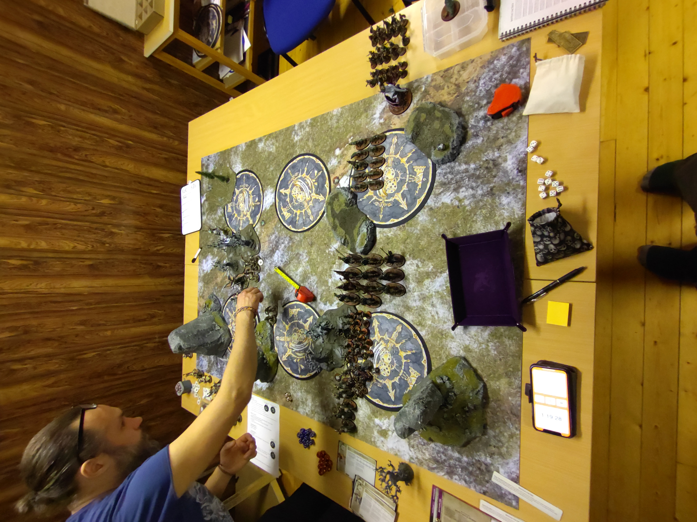

# SBG vs SCE

## Mission
Won't Back Down

### Resultat
Vinst
27 - 15

#### Battle Tactics / Grand Strategies
SBG
Take What’s Theirs (Lyckades)
1) Against The Odds (Lyckades)
2) Barge Through Enemy Lines (Lyckades)
3) Eye for an Eye (Lyckades)
4) Gaining Momentum (Lyckades)
5) Desecrate Their Lands (Lyckades)
Take What’s Theirs (Lyckades)

SCE
Hold the Line (Misslyckades)
1) Barge Through Enemy Lines (Misslyckades)
2) Eye for an Eye (Misslyckades)
3) Against The Odds (Lyckades)
4) Desecrate Their Lands (Lyckades)
5) ?

## Terräng
Nöjd med terrängen denna matchen, vi läste lite mer på rekommendationerna och körde med 2 stora, 4 mellan (skog!) och 2 små terrängbitar. Vart ett bättre spelbord. Vi spelade även Terrängspelet 

## Gravesites
Vart en bra deployment av Gravesites, kanske kunde satt de i min deployment zone lite längre bak för att enklare kunna deploya på mina egna objectives från graven.

## Deployment
Vart en bra offensiv deployment, många objectives och endel shooting mot mig så att inte pusha frammåt vart en dålig idé. Skulle dock använt min Wight King till att screna av drops bättre i min backline. Kanske även ställt Vengorian Lorden lite längre bakåt för att screena ut 9".

Följade deployade i graven
* Grave Guards 2h x10
* 2x Deathrattle Skeletons x10

## Battle
Fick inte första turen vilket vart lite förvåndande. Fick en drop av Annihilators mot mina Black Knights och Evocators i min backline då jag inte screnat ordentligt, och med reroll så lyckades de få in en 9" charge på mina Blood Knights och drog de med sig min 20x Grave Guards och min Wight King. Tappade 4st Blood Knight totalt första runda till shooting + evocator chargen. Men lyckades wipa alla Evocators iaf! På min första tur så chargeade jag in mina blood knights i Vindictors och dödade bara 2 modeller, en i var enhet. Mina Grave Guards gjorde en run frammåt då de fick pilea bakåt för att döda Evocators, +1A command abilityn från Vampire Lords är riktigt sweet! 
Necromancer och Vampire lord gick frammåt medans skeletten gjorde Grave Guards sällskap i springandet. Fick av alla mina buffar, och min Overwhelming Dread på Annihilators vart auto-denyad.
Mina Black Knights lyckades döda en Annihilator på MW:s på chagen vilket vart najs och mina Vargar tog tillsammans med min Vengorian Lord ut de Castigators som droppades på högra mittobjektivet. Rundan/Turen slutade med lyckad BT och 5VP:s.
Tog en dubbeltur in i runda 2 då jag såg lite möjligheter att rensa upp, chargeade in mina Grave Guards i en enhet Vindictors och dödade den enkelt, dock missade jag att sälla mig så att jag kunde pilea in i nästa enhet, de vart dumt då jag hade Vanhels Danse Macabre och hade fått aktivera 2ggr!
Blood Knights körde en Riders of Ruin och fick av en chagre på Lord-Arcanum on Gryph-charger men den skulle envist överleva med 2W och dum som jag va hade jag inte chargeat in min Vengorian Lord, då hade eländet varit dött 100% och jag hade sluppit teleporterade Gryphons! Chargeade också modigt in mina skelett in i 1h+shield Anninilators och de överlevde, vart helt paff. De höll Annihilators i 2 rundor, bra 80pts:)
Failade också min 5+ Rally på mina Black Knights, 4D6 och ingen 5+ (bonus från Battleplanen)
Turen slutade med lyckad BT och 5VP:s.
Fick inte prio in i runda 3, det droppades massa elände i ryggen på mig. Tappade nästan hela min 20:a Grave Guards, tänkte inte på att spara ett CP så 5st sprang iväg. Men de dödade en enhet Vindictors och med Vanhels fighta 2ggr så dödade de nästan Yndrasta också. Sen dog min general helt gratis då jag placerat mig så dåligt så jag inte kunde chargea i runda 2. Necromancern vart också chargead och dödad. Tappade även enheten med Skelett nu, men de tog 2rundor av fighting + lite shooting för Annihilatorna att göra sig fria. Tappade även min sista Black Knight till shooting. Och ingen lyckad Endless Legion roll heller.
På min tur så dödade jag Yndrasta med Vengorian Lord + Blood Knights och klarade Eye for an Eye, droppade även alla mina grejer från Graven och tog 2st Objectives. Här tog tiden slut (vi spelade med shack klocka för förstagången). Så Runda 4 och 5 spelade vi inte utan vi räknade bara fram vad som troligen skulle hända då jag dödat ganska mycket av SCE och hade massa enheter kvar på/nära objectives. 

Horrorghast vart helt värdelös då Yndrasta gör allt innom 12" battleshock immune!

## Listan
Spelade samma lista som mot Henrik i December. Tycker att listan funkar ganska ok. Men finns ett par saker jag vill ändra. Wight Kingen ska bytas bort bland annat. Men kommer ju ny Battle Scroll och GHB snart, så kanske får bli att det är släppt.

### Batallions

#### Bounty Hunters
BH gjorde bra ifrån sig denna matchen, gött med D3 Grave Guards och Blood Knights (på chargen). Men ska bli skönt med ny GHB så man kan börja spela Battle Line igen

#### Warlords
Körde med +1Sv artifact på Vengorian Lord och Arcane Tome på Vampire lord, bra combo. Ger mig möjligheten att få ut min endless spell. Men glömde ju givetvis mitt jäkla command point!

#### Grave Guards 2h x20
De köttade på bra denna matchen, de dödade nästan yndrasta på en combat, en failad save till så hade nog inte 4+ warden räddat henne.
#### Grave Guards 2h x10
Tänkte inte på att deploya dem runda 2, så de kom in lite för sent. Men bra utility att ha då det är bra skada på dem.

#### Blood Knights
Bra utility som alltid, bra tillfälle att använda Riders of Ruin. Synd att de inte dödade killen på gryphonen också.

#### Black Knights
Bra utility enhet/screen. D3 MWs på chargen ska inte underskattas. Hade varit najs om de haft samma regel som Grave Guards och MWs på 6or to wound in addition.

#### Vengorian Lord
MVP, tankade massor med -1Rend och +1Sv artifact. Fick till slut ihjäl en enhet Varanguard, tankiga saker. 

#### Skelett
En enhet tankade Annihilators i 2 rundor, vart helt paff hur bra jobb de gjorde. De andra 2 droppade runda 3 och ugglade på objectives. 

#### Vampire Lord
Använde +1A command abilityn och Grave Guards levererade med +50% fler attacker. Ska bli kul i nästa GHB då man kan ge dem "slåss i två ranker" grejen och kanske få in alla 20, nu tycker jag alltid att det är ngn som har semester.

#### Necromancer
Fick av Vanhels Danse Macabre på mina Grave Guards och de köttade på bra. Bra buffare

#### Dire Wolves
De tog objectives och dödade Castigators. Bra och snabb screen

#### Wight King på Skeletal Steed
Bättre än till fots, men ska se om jag kan hitta något bättre att läga poängen på.