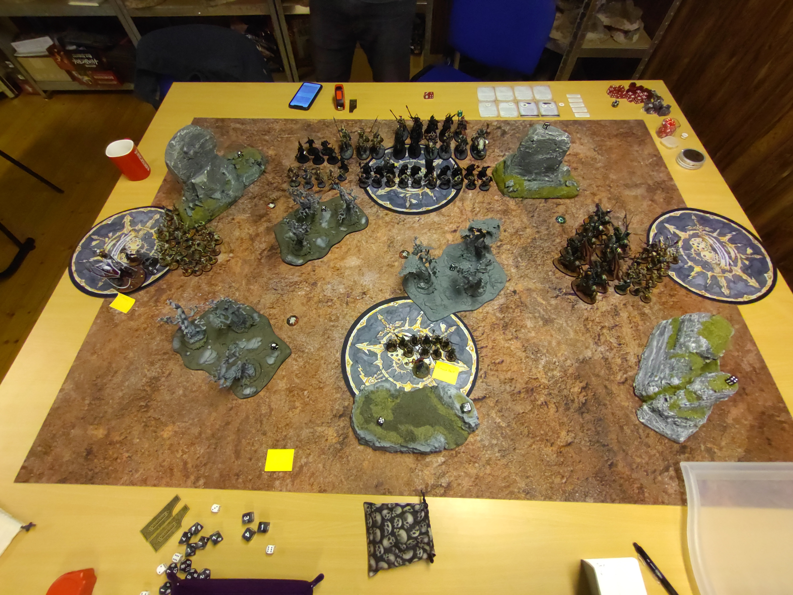
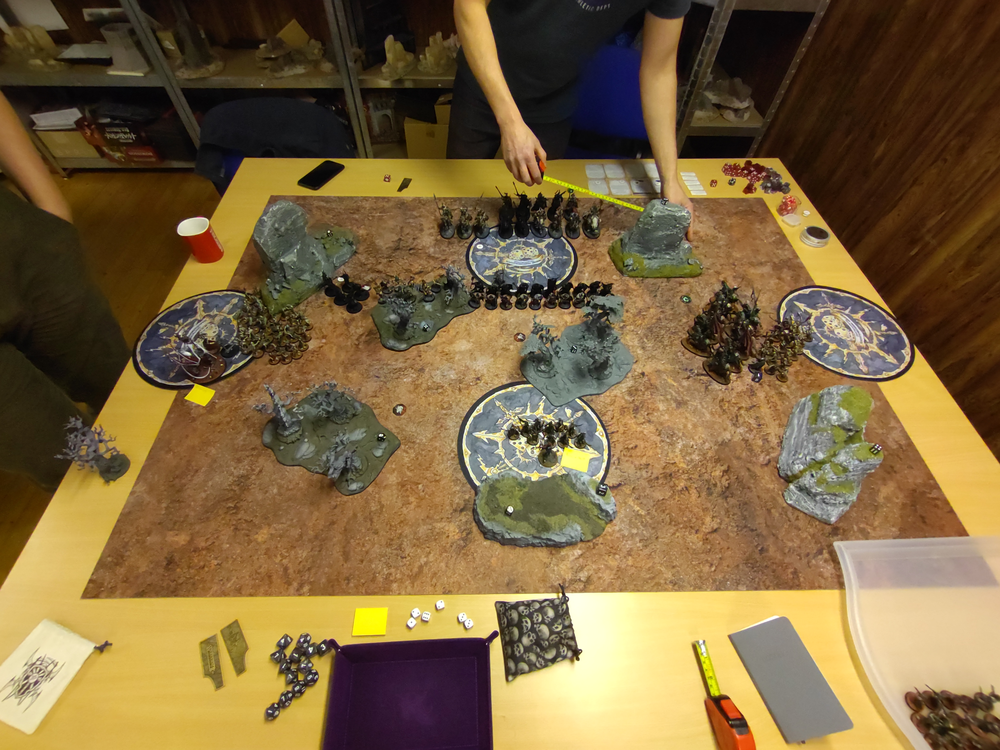
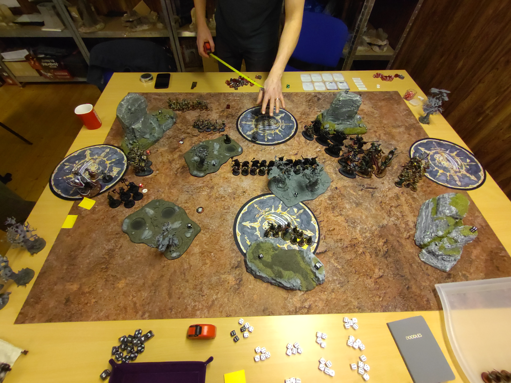
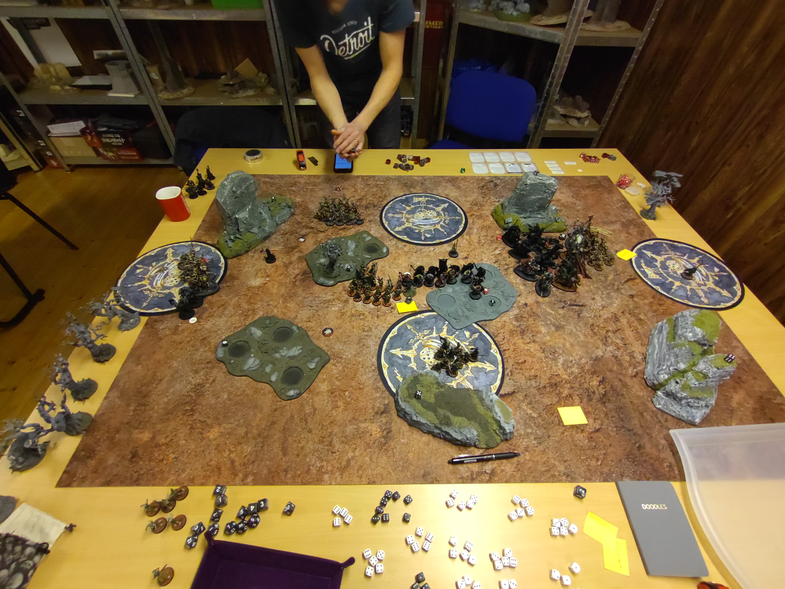

# Soulblight Gravelords vs Slaves to Darkness

**SM-Kvalmatch**

## Mission
Position Over Power

### Resultat
Förlust
20 - 21

### Battle Tactics / Grand Strategies

**Soulblight Gravelords**
Grand Strategy

Take What’s Theirs (Misslyckades)

Battle Tactics
1) Desecrate Their Lands (Lyckades)
2) Cunning Manoeuvre (Lyckades)
3) Unstoppable Armies (Misslyckades) (Soulblight Gravelords)
4) Callous Overlord (Lyckades) (Soulblight Gravelords)
5) Eye for an Eye (Misslyckades)

**Slaves to Darkness**

Grand Strategy

Take What’s Theirs (Lyckades)

Battle Tactics
1) Desecrate Their Lands (Lyckades)
2) Run Them Down (Lyckades) (Slaves to Darkness)
3) The March of Ruin (Misslyckades) (Slaves to Darkness)
4) In Thrall to Chaos (Lyckades) (Slaves to Darkness)
5) Gaining Momentum (Lyckades)

## Terräng

Kul terrängsetup med hjälp av [Terrängspelet](../../../SM/terr%C3%A4ngspelet.md). Kommer att använda väderstrecken och jag har deployat i söder. Får se om jag kan komma på något bättre sätt att benämna spelbrädet, men behöver något för att kunna beskriva saker.

## Gravesites
Vart en bra deployment av Gravesites, bra täckning för wardsaven och bra grave deployment möjligheter.

## Deployment
På det stora hela nöjd med deployment. Känndes genomtänkt och saker vart på rätt ställe. Men det vart mest tur att Blood Knigts vart Wholly Within 12" av Kattarin för att kunna kasta Mystic Shield (som iofs vart unbound, men ändå dumt att inte kontrollmäta!). Att lägga det mesta av de långsamma enheterna i Graven vart rätt beslut. Kanske skulle haft de 10 skeletten på hemma objektivet där också. De gjorde inte mycket nytta där som de vart.

Följade deployade i graven
* Zombies x40
* Grave Guards 2h x20
* Deathrattle Skeletons x20

## Listor

* [Soulblight Gravelords](soulblight-lista-2023-01-19.md)
* [Slaves to Darkness](slaves-to-darkness-lista-2023-01-19.md)

## Battle

### Round 1

### Top - Soulblight Gravelords

**Heroic Actions**

Chaos Lord
- Heroic Leadership (Lyckades)
Vampire Lord 
- Heroic Leadership (Lyckades)

Spells:
Vengorian Lord: Flaming Weapon
Vampire Lord: Amethystine Pinions
Kattarin (Vampire Lord):
 - Mystic Shield (Unbound)
 - Arcale Bolt
Necromancer#1: -
Necromancer#2: -

**Movement**

Vampire Lord och Vengorian Lord avancerar mot flank objektiven. Blood Knights placerar sig vid de östtra objektivet. Dock högst oklart varför de inte chargear Chaos Warriors.
Necromancer#2 avancerar mot östra objektivet
Skeletten och Kattarin (Vampire Lord) säkrar skogen vid hemma objektivet.
Necromancer#1 tunnlar bort till det högra objektivet.

Från graven deployar Zombies på de västra objektivet, skelett på det östra objektivet. 

***Skogen vanhelgas och Vampyrerna tar 6VP***

### Bottom - Slaves to Darkness

**Heroic Actions**

Chaos Sorcerrer Lord#1
- Heroic Leadership (Lyckades)
- Draw on Power

Necromancer#2:
- Heroic Leadership (Lyckades)

**Spells**

Chaos Sorcerrer Lord#1: 
- Daemonic Speed
- Mystic Shield (Unbound)

Chaos Sorcerrer Lord#2: 
- Daemonic Power

Movement
Chosen och Varanguard avanderar mot västra objektivet, Chaos Warriors avancerar mot mitten, Spire Tyrants intar den andra skogen i mitten. Chaos Knights och Chaos Lord on Karkadrak avancerar mot östra objektivet. Chaos Sorcerrer Lord#1 håller hemma objektivet och Chaos Sorcerrer Lord#2 gör Spire Tyrants sällskap i skogen.

Charges
Chosen och Varanguard chargear Zombies, Chaos Knights chargar Blood Knigts. Chaos Lord on Karkadrak använder Forward to Victory men misslyckas att chargea.

Fight:
Varanguard dödar 19 zombies
Zombies gör 3W på en Varanguard och 2W på en Chosen.
Chosen dödar resten av Zombies med sin Fight twice ability
Chaos Knights dödar 4st Blood Knigts
Blood Knigts Dödar 1st Chaos Knigt

Battleshock:
20 Zombies återuppstår genom Endless Legions i Slaves baklinje

***Skogen vanhelgas och Slave tar 3VP***

### Round 2

#### Top - Slaves to Darkness

Chaos Lord on Karkadrak: Their Finest Hour
Vengorian Lord: Their Finest Hour

Spells:
Chaos Sorcerrer Lord#1: 
- Daemonic Speed
- Mystic Shield (Unbound)

Chaos Sorcerrer Lord#2: 
- Daemonic Power

Movement:
Varanguard och Chosen avancerar mot västra objektivet och Spire Tyrants avancerar mot de nya Zombie hotet. Chaos Warriors avancerar mot Soulblights hemmaobjektiv.

Charge:
Varanguard chargear Vampire Lord och Necromancer
Chosen chargear Vengorian Lord
Spire Tyrants misslyckas med att Chargea Zombies
Chaos Lord Chargear Blood Knigits

Vengorian Lord stampar på Chosen, 1 dör

Fight:
Varanguard dödar Vampire Lord
Vengorian Lord dödar 2 chosen
Chosen gör 6W på Vengorian Lord
Varanguard slåss 2ggr och dödar Vengorian Lord och Necromancer#1
Chaos Lord dödar 1st Blood Knigt
Chaos Knights dödar 1st Blood Knight

***Slaves krashar in i Vampyrernas linje och tar 3VP***

### Bottom - Soulblight Gravelords

**Heroic Actions**

Chaos Lord
- Heroic Leadership (Lyckades)
Kattarin (Vampire Lord)
- Heroic Leadership (Misslyckades)
- Their Finest Hour

Spells:
Kattarin (Vampire Lord):
 - Mystic Shield (Unbound)
 - Arcale Bolt
Necromancer#2: Vanhels Danse Macabre

**Movement**

Kattarin avancerar med sina skelett mot Chaos Warriors i mitten av slagfältet. Necromancer#2 springer upp på östra objektivet och skeletten vid de östra objektivet avanderar mot Chaos Lorden. Varför inte Blood Knights byter position med Riders of Ruin är ett mysterium. Ett större mysterium är varför Zombies inte gör reträtt till Slaves hemma objektiv.

Från Graven deployar Grave Guards redo att förgöra Chaos warriors

**Charge**

Grave Guards använder Forward to Victory och Chargear Chaos Warriors
Kattarin Chargear Chaos Warriors
Skeletten chargear Chaos Warriors
Skeletten på östra fronten chargear Chaos Lord

**Fight**

Kattarin använder sin Arcane Bolt på Chaos Warriors, 1MW blockeras av Wardsave
Grave Guards får Crimson Feast, men lyckas inte döda mer än 6st Chaos Warriors
Chaos Knights pilear in Blood Knigts och dödar 1st Blood Knight
Skeletten slår på Chaos Lord, gör 2W
Chaos Warriors dödar skeletten i mitten, samt gör 2W på Kattarin
Chaos Lord dödar 11 Skelett
Kattarin gör ingen skada på Chaos Warriors

**Battlechock**
3 Skelett springer
2 Chaos Knights springer p.g.a coherency

***Necromancer#2 gör en slug manöver och tar 5VP***

### Round 3

### Top - Slaves to Darkness

**Heroic Actions**

Chaos Lord
- Heroic Leadership (Lyckades)
Kattarin (Vampire Lord)
- Heroic Leadership (Lyckades)

Spells:
Chaos Sorcerrer Lord#1: 
- Daemonic Speed
- Mystic Shield

Chaos Sorcerrer Lord#2: 
- Daemonic Power

**Movement**
Chosen, Chaos Sorcerrer Lord#2 och Varanguard avancerar mot Grave Guards.

**Charge**
Chosen och Varanguard Chargear Grave Guards

**Fight**
Varanguard Dödar 6 Grave Guards
Grave Guards får Crimson Feast igen och dödar 1 Chaos warrior och Chosen
Chaos Warriors pilerar in och tar Soulblight Hemma Objektiv samt dödar Kattarin
Skeletten gör 1W på Chaos Lord
Chaos Lord dödar de sista 2 Blood Knigtsen
Skeletten gör ytterliggare 1W på Chaos Lord m.h.a. Vanhels

**Battlechock**
5 skelett reser sig ur graven på det västra objektivet

***Grave Guards avslutar Chosens marsh och skeletten plockar slugt ett objektiv för Slaves som tar 2VP***

### Bottom - Soulblight Gravelords

**Heroic Actions**

Necromancer#2
- Heroic Leadership (Lyckades)
Chaos Lord
- Heroic Leadership (Missyckades)

Spells:
Necromancer#2: Vanhels Danse Macabre (Missyckades)

**Movement**
Skeletten i väster avancerar mot mitten
Zombies gör reträtt från Spire Tyrants.
Grave Guards gör reträtt  från Chaos Warriors och Varanguard till soulblight hemma objekitv
Necromancern springer mot Slaves territorie

**Fight**
Skeletten pilear mot Chaos Knights och försöker desperat bli dödade. Men både Chaos Lord och Chaos Knight wiffar totalt och dödar bara 4 av 7. Skeletten gör 1W på Chaos Lord

***Vampyrerna håller alla objektiv, men då armen inte vart så ostoppbar som man trodde med tomma gravar så tar man 4VP ***

### Round 4

#### Top - Soulblight Gravelords

**Heroic Actions**

Necromancer#2
- Heroic Leadership (Lyckades)
Chaos Lord
- Heroic Leadership (Missyckades)

**Spells**

Necromancer#2: Arcane Bolt

**Movement**
Zombies springer in på Slaves hemma objektiv
Necromancer#2 forstätter sin språngmarch mot Slaves territorie och passar på att skjuta en Arcane Bolt på Chaos Lord

**Charge**
Skeletten i väster chargear Varanguard

**Fight**
Skeletten gör ingen skada på Varanguard
Chaos Lord dödar Skeletten
Varanguard dödar skeletten

**Battlechock**
10 Skelett reser sig ur graven precis vid Necromancern

Helt okännsligt så tar Soulblight 5VP

#### Bottom - Slaves to Darkness

**Heroic Actions**

Necromancer#2
- Heroic Leadership (Lyckades)
Chaos Sorcerer Lord#1
- Draw on Power
- Heroic Leadership (Lyckades)

**Spells**

Spells:
Chaos Sorcerrer Lord#1: 
- Daemonic Speed
- Mystic Shield

Chaos Sorcerrer Lord#2: 
- Daemonic Power

**Movement**
Chaos Lord springer mot Necromancern som redeployar 6"
Varanguard och Chaos Warriors positionerar sig för en charge på Grave Guards
Chaos Sorrcerer Lord#2 Tunnlar för att blockera en grave deploy
Chaos Knights flyttar till sitt hemma objektiv

**Charge**
Varanguard Chargear Grave Guards
Chaos Chosen Chargear Grave Guards
Chaos Knight Chagear Zombies
Chaos Lord Chagear Skelett+Necromancer

**Fight**
Chaos Lord försöker döda Necromancer#2, men gör 2W och råkar döda 7 skelett
Chaos Warriors dödar Grave Guards
Zombies gör ingen skada på Chaos Knights
Chaos Knights dödar alla Zombies
Necromancer#2 och Skeletten gör 1W på Chaos Lord

***Som de trälar de är tar Slaves 5VP***

### Round 5

#### Top - Slaves to Darkness

Slaves har moment i matchen, dödar Skeletten och Necromancern, och tar 8VP.
För Soulblight är det tyst i graven.

#### Bottom - Soulblight Gravelords

Soulblight har inget kvar och tar 0VP 

## Analys

Det vart rätt beslut att ta runda1, satte upp bra positioner på flank objektiven. På östra flanken skulle dock definitivt chargeat mina Blood Knights i Chaos Warriors runda 1. Förstår inte varför jag tyckte att de skulle stå mitt på slagfältet och titta på. På västra flanken så overcommittade jag något kopiöst, varför skulle jag ha Necromancer, Vampire Lord och Vengorian Lord där för. Det vart ju en gratis wipe av allt där när Varanguard och Chosen bara kunde traska dit och göra rent. Skeletten på hemmaobjektivet hade nog kunnat ligga i graven de med. Sen vart det ett par otroliga missplays. Varför lämnade jag inte fighten med Chaos Knigts botten på runda 2 och varför glömmer jag att reträttera mina Zombies till objektivet. Där tappar jag 1VP helt i onödan. Sen överskattade jag Grave Guards möjlighet att döda Chaos Warriors. Skulle kanske hållit dem i graven en runda till för den fighten i mitten kostade mig ytterliggare 1VP då Chaos Warriors kunde pilea in på objektivet. Sen vart Grave Guards låsta mellan Warriors och Varanguard och gjorde inte de jobb de hade behövt göra. Sen vart det svårt att hitta battle tactics, och att slaves verkar ha massor med relativt enkla battle tactics att göra gjorde ju inte matchen lättare även om jag lyckades denya en där chosen vart tvunga att chargea Grave Guards för att komma in i mitt territorie och de överlevde Varanguards och med +2A från Crimsom Feast så fick 2 Chosen äta 43 attacker från Grave Guards. De vart bara mos.
Sen vart det enclutch Callous Overlord när mina 5 skelett gör sin 8" charge mot Varanguard och scorear en Battle Tactic. Även Fighen rundan innan där jag försökte få Chaos Lord och Chaos Knight att döda 7st skelett så jag kunde få rolla på Endless Legios för den Battle Tacticen då jag inte hade en chans på någon annan. 