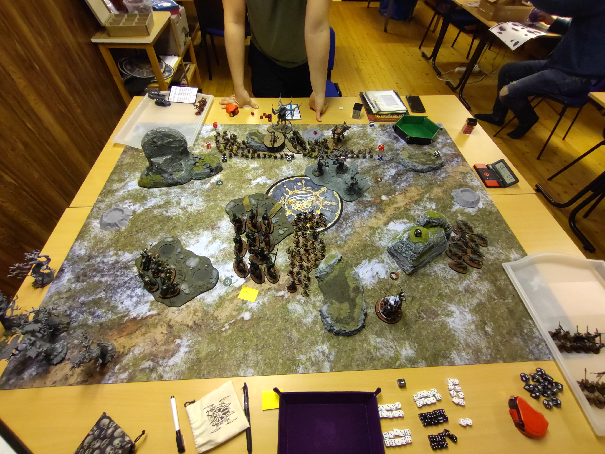
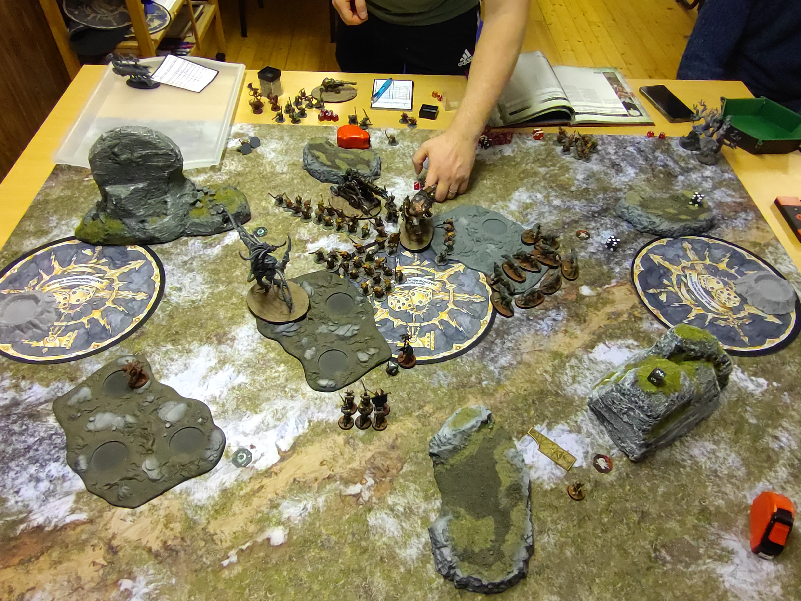
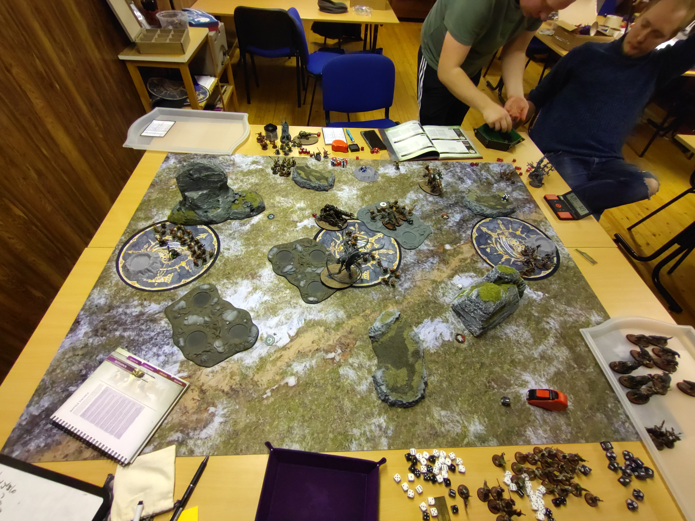
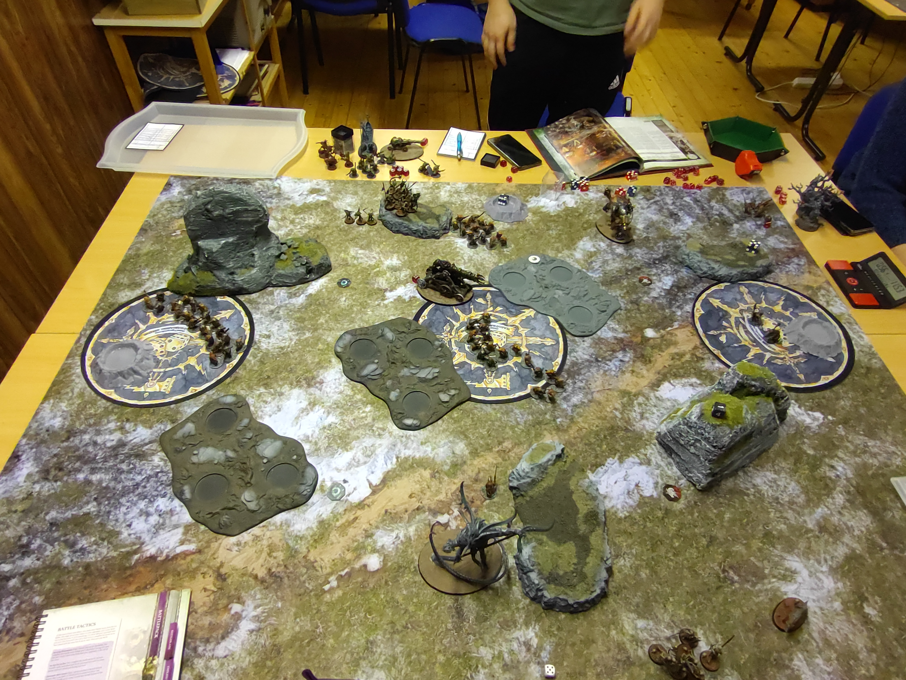

# Soulblight Gravelords vs Skaven

**SM-Kvalmatch**

## Mission
Realmstone Cache

### Resultat
Förlust
12 - 24

### Battle Tactics / Grand Strategies

**Soulblight Gravelords**
Grand Strategy

Take What’s Theirs (Misslyckades)

Battle Tactics
1) Cunning Manoeuvre (Lyckades)
2) United Offence (Lyckades)
3) Eye for an Eye (Misslyckades) 
4) Desecrate Their Lands (Lyckades)
5) Callous Overlord (Misslyckades) (Soulblight Gravelords)

**Skaven**

Grand Strategy

Take What’s Theirs (Lyckades)

Battle Tactics
1) Gaining Momentum (Misslyckades)
2) Desecrate Their Lands (Lyckades)
3) Cunning Manoeuvre (Lyckades)
4) This One's Mine (Lyckades)
5) United Offence (Lyckades)

## Terräng

Terrängsetup med hjälp av [Terrängspelet](../../../SM/terr%C3%A4ngspelet.md). Kommer att använda väderstrecken och jag har deployat i söder. Får se om jag kan komma på något bättre sätt att benämna spelbrädet, men behöver något för att kunna beskriva saker.

## Gravesites
Vart en bra deployment av Gravesites, bra täckning för wardsaven och bra grave deployment möjligheter. Det enda jag missade vart att verkligen mäta så att jag fick wardsave utan karaktärer på hela mitten objektivet. Känndes som att Grave sites täckte upp alla möjligheter vid objektiv explosionen i runda 3.

## Deployment

Vet inte riktit hur jag skulle deployat här. Tror det vart fel att ha mina 20a Grave Guards i Graven. Skulle antagligen haft mina Zombies där istället och sen droppat mina ett av mina sett med skelett för att ta mitten objektivet första rundan. 

Följade deployade i graven
* Zombies x40
* Grave Guards 2h x20
* Grave Guards 2h x10
* 2x Deathrattle Skeletons x10

## Listor

* [Soulblight Gravelords](soulblight-lista-2023-01-27.pdf)
* [Skaven](skaven-lista-2023-01-27.md)

## Battle

### Round 1

### Top - Soulblight Gravelords

**Hero Phase**

**Heroic Actions** 
Thanquol
- Heroic Leadership (Lyckades)
Vampire Lord 
- Heroic Leadership (Lyckades)

Spells:
Vengorian Lord: Flaming Weapon
Kattarin (Vampire Lord):
 - Mystic Shield (Unbound)
Necromancer: Vanhels Danse Macabre (Misslyckades)

**Movement**

Zombies springer mot mittenobjektivet, Vampire Lord och Necromancer följer med. Vengorian Lord ställer sig säkert från kanon elden. Blood Knights avancerar mot mitten och förbereder ett anfall. Black Knights täcker upp västra flanken och Dire Wolves östra flanken. 

***Efter en slug manöver så tar Vampyrerna 4VP***

### Bottom - Skaven

**Hero Phase**

**Heroic Actions** 
Thanquol
- Heroic Leadership (Lyckades)

Vampire Lord:
- Heroic Leadership (Lyckades)

**Spells**

Verminlord Warbringer: 
- Dreaded Death Frenzy (Unbound)
- ?

Thanquol:
- Launchon (Unbound)
- Mystic Shield

Warlock Engineer:
- Warp Lightning

**Prayers** 

Plauge Priest
- Pestilence-pestilence! (Great Plague: The Neverplague)

**Movement**

Clan rats och plague monks flyttar upp mot mitten objektivet. Verminlord teleporterar till västra objektivet via gnawholes. Thanquol går frammåt mot mitten, ena warplightning cannon placerar sig för att få line of sight till Blood Knights.
Slink Deepstrikear vid västra objektivet och linear upp en charge mot Black Knights tillsammans med Verminlord

**Shooting**

En Warplightning Cannon Skjuter in i Blood Knights och gör 11MWs, den andra skjuter in i Zombies och gör 2MWs.

**Charges**

Plauge Monks chargear Zombies, men behöver använd Forward to Victory. Verminlord och Slynk misslyckas med Chargen. Men Slynks kompisar lyckas.

**Fight**

Plauge Monks dödar 12 zombies
Black Knights dödar 2 ur Slynks gäng
Slynks gäng dödar 1 Black Knight och skadar en annan.
Vampire Lord dödar 2 Plague Monks
Plauge Monks dödar 2 zombies
Zombies dödar 5 Plauge Monks
Plauge Monks dödar 7 zombies

5 Zombies återuppstår via The Newly Dead

**Battleshock**

Slynks gäng flyr
Plauge Monks autopassar Morale

***Skaven får inget moment i matchen och tar 2VP***

### Round 2

#### Top - Soulblight Gravelords

**Hero Phase**

**Heroic Actions** 
Vampire Lord:
- Strike at The Opening, dödar 2 Plague Monks

Thanquol:
- Heroic Leadership (Misslyckades)

**Spells**

Necromancer:
- Mystic Shield (Misslyckas)

Vampire Lord:
- Arcane Bolt
_
Vengorian Lord:
- Flaming Weapon

**Movement**

Sista Plague Monken dör av Arcane Bolt

Blood Knigts och Black Knigts planerar en charge mot Clan Rats i mitten. Vengorian Lord och Dire Wolves avancear för en chage in i clan rats på västra flanken. Necromancern gör en sprint in på objektivet i mitten.

10 Grave Guards kommer från Graven

**Charge**
Black Knights och Blood Knights chargear Clan Rats på högra flanken.
Black Knights gör 2MWs på chargen.
Vengorian Lord chargar clan rats, Warplightning Cannon gör 7MWs på Unleash Hell och sen exploderar den.
Dire Wolves chargear Clan Rats.
Grave Guards misslyckas med Chargen

**Fight**
Vengorian Lord dödar 5st Clan rats
Clan Rats dödar 1 Black Kngits och 1 Blood Kngit tar 2W.
Blood Knigts dödar 5 Clan Rats
Clan Rats gör 2W på Vengorian Lord
Dire Wolves gör dödar 5 Clan Rats
Black Knigts dödar 2 Clan rats
Zombies dödar 5 Clan Rats

2 Zombies återuppstår via The Newly Dead

**Battleshock**
4 Clan Rats flyr

***Vampire lord och Necromancer tar via en gemensam offensiv 4VP***

### Bottom - Skaven

**Hero Phase**

**Heroic Actions** 
Thanquol
- Heroic Leadership (Lyckades)
Vengorian Lord
- Their Finest Hour

**Spells**
Verminlord Warbringer: 
- Dreaded Death Frenzy
- ?

Thanquol:
- Launchon (Unbound)
- ?

Warlock Engineer:
- Warp Lightning

**Prayers**

Plauge Priest
- Pestilence-pestilence! (Great Plague: Bubonic Blightplague) - 11MWs på Blood Knigts!, Dödar Vengorian Lord

**Movement**
Thanquol avancerar mot mitten objektivet, Verminlord positionerar sig för en charge på Blood Knigts och Black Knights.
Slynk gömmer sig i sydvästra skogen.

**Shooting**
Thanquoul rostar 20 Zombies, enheten är utplånad.
Warplightning Cannon dödar Vampire Lord

**Charge**
Verminlord chargear Black- och Blood Knights

**Fight**
Verminlord utplålar både Black Knights och Blood Knights
Dire Wolves äter upp 2st Clan Rats

**Battleshock**

--

***Slynk vanhelgar skogen och Skaven tar 4VP***

### Round 3

Objektivet i mitten exploderar, tärningen visar 5-6 och 2 nya objektiv hamnar i öst och väst.

### Top - Skaven

**Hero Phase**

**Heroic Actions**

Necromancer
- Heroic Leadership (Misslyckades)

Thanquol
- Heroic Leadership (Misslyckades)

**Spells**

Verminlord
- Dreaded Death Frenzy

Thanquol
- Launchon

Warlock Engineer:
- Mystic Shield

**Prayers**
Plauge Priest
- Rabid-rabid

**Movement**

Slynk flyttar sig i postition för en charge.
Thanquol teleporterar till östra objektivet med Launchon
Warlock Engineer använder Gnawholes för att ta sig till västra objektivet.
Clan Rats och verminlord screenar av västra objektivet.
De andra clanrat enheterna avancerar mot söder och öster.

**Shooting**
Slynk wiffar mot Necromancern

**Charge**
Slynk Chargear Necromancern

**Fight**
Slynk Dödar Necromancern
Graveguards dödar Slynk

**Battleshock**

--

***Warlock Engineerns sluga manöver ger Skaven 5VP***

### Bottom - Soulblight Gravelords

**Hero Phase**

Thanqoul: 
- Finest Hour

**Spells**

--

**Movement**

20 Grave Guards droppar från Graven i nordöst
10 Skelett droppar i nordväst
10 skelett droppar i sydöst

**Charge** 
20 Grave Guards använder Forward to Victory men misslyckas med Charge
Dire Wolves chargear Clan Rats

**Fight**
Dire Wolves dödar 3 Clan Rats
Clan Rats dödar 2 Vargar

**Battleshock**

***Vampyrerna håller inga objektiv, Misslyckas med sin taktik och tar 0VP***

--

### Round 4

#### Top - Skaven

**Hero Phase**

**Heroic Actions**

Thanquol
- Heroic Leadership (Misslyckades)

**Spells**

Verminlord
- Dreaded Death Frenzy

Thanquol
- Arcane Bolt

Warlock Engineer:
- ?

**Prayers**

Plauge Priest
- ?

**Movement**

Thanquol avancerar mot 20x Grave Guards
Verminlord avancerar mot 6x Grave Guards

**Shooting** 

Thanquol dödar 20 Grave Guards med Warfire Throwers

**Charge**

Verminlord chargear Grave Guards

**Fight**

Verminlord dödar Grave Guards

**Battleshock**

--

*** Verminlorden slaktar de grave guards han har i sikte och skaven tar 5VP ***

#### Bottom - Soulblight Gravelords

**Hero Phase**

**Heroic Actions**

Thanquol
- Heroic Leadership (Lyckades)

**Spells**

--

**Movement**

Skeletten på östra flanken springer och tar östra objektivet.
Skeletten på västa flanken springer och intar terräng i Skavens Territorie

**Charge**

--

**Fight**

--

**Battleshock**

20 Zombies reser sig via Endless Legions i Skavens Territorie

*** Terrängen vanhelgas och Vampyrerna tar 3VP ***

### Round 5

#### Top - Soulblight Gravelords

**Hero Phase**

--

**Spells**

--

**Movement**

Skeletten på östra flanken förbereder en charge mot Thanquoul
Dire Wolves retriterar in i Skavens territorie

**Charge**

Skeletten på östra flanken chargear Thanquol

**Fight**

Skeletten gör ingen skada på Thanqoul
Thanqoul dödar 4 skelett

**Battleshock**

--

*** Skeletten överlever mästarens grymma plan och Vampyrerna tar 1VP***

#### Bottom - Skaven

**Hero Phase**

**Heroic Actions**

--

**Spells**

--

**Movement**

Plauge Priets tunnlar över till östra objektivet och Warlock Engineer Teleporterar via Gnawhole.
Clan rats Förbereder en charge på Dire Wolves

**Shooting**
Warpligthning Cannon dödar 1 Varg
Thanqoul dödar resteradne skelett med Warpfire Cannon

**Charge**
Clan Rats chargear den sista Vargen

**Fight**

Clan Rats dödar den sista vargen

**Battleshock**

--

***Plauge Priest och Warlock Engineers enade offensiv lyckas och Skaven tar 8VP***

