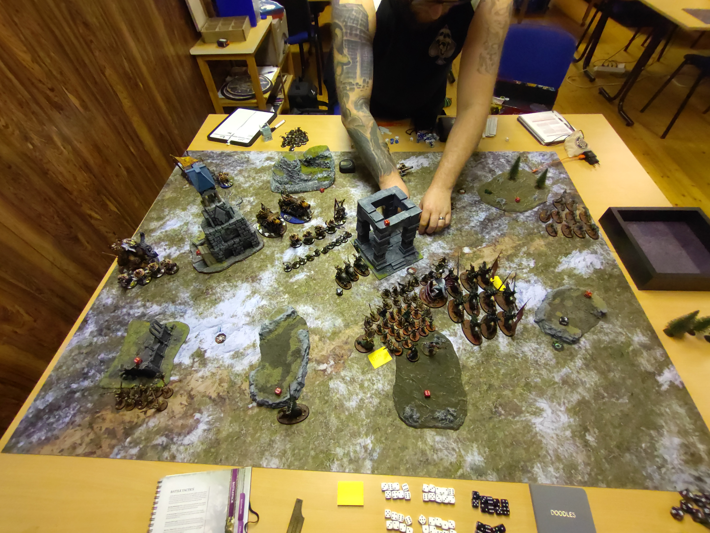
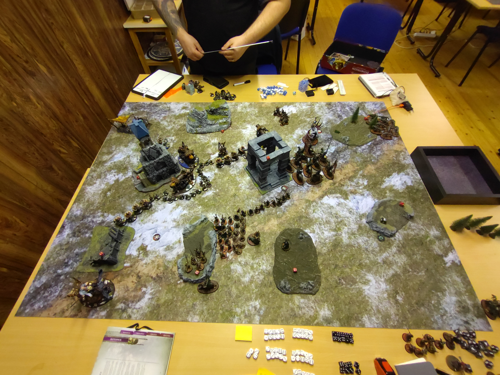

# Soulblight Gravelords vs Ogor Mawtribes

**SM-Kvalmatch**

## Mission
Battlelines Drawn

### Resultat
Förlust
19 - 27

### Battle Tactics / Grand Strategies

## **Soulblight Gravelords**

**Grand Strategy**

Take What’s Theirs (Misslyckades)

Battle Tactics
1) Desecrate Their Lands (Lyckades)
2) Against The Odds (Lyckades)
3) Eye for an Eye (Lyckades)
4) Callous Overlord (Lyckades) (SBG)
5) Unstoppable Armies (Misslyckades) (SBG)

## **Ogor Mawtribes**

Grand Strategy

Take What’s Theirs (Lyckades)

Battle Tactics
1) Desecrate Their Lands (Lyckades)
2) Savour the Taste (Lyckades) (Ogor Mawtribes)
3) Against The Odds (Lyckades)
4) Eye for an Eye (Lyckades)
5) Barge Through Enemy Lines (Lyckades)

## Terräng

Kul terrängsetup med hjälp av [Terrängspelet](../../../SM/terr%C3%A4ngspelet.md). Kommer att använda väderstrecken och jag har deployat i söder. Får se om jag kan komma på något bättre sätt att benämna spelbrädet, men behöver något för att kunna beskriva saker.

## Gravesites
Vart en bra deployment av Gravesites, bra täckning för wardsaven. Kanske den längst bak i min zon inte gjorde så mycket nytta då Ogres inte har deepstrike.

## Deployment
Vart en bra offensiv deployment, många objectives och endel shooting mot mig så att inte pusha frammåt vart en dålig idé. Skulle dock använt min Wight King till att screna av drops bättre i min backline. Kanske även ställt Vengorian Lorden lite längre bakåt för att screena ut 9".

Följade deployade i graven
* Grave Guards 2h x10 (Bounty Hunters)
* 2x Deathrattle Skeletons x10 (Expert Conquerors)

## Listor

* [Soulblight Gravelords](soulblight-lista-2023-01-12.pdf)
* [Ogor Mawtribes](ogormawtribes-lista-2023-01-12.pdf)

## Battle

### **Round 1**

### Top - Ogor Mawtribes

Tyrant: Heroic Leadership (Lyckades)
Vampire Lord: Heroic Leadership (Misslyckades)

**Spells**
Butcher: Blubbergrub Stench

**Movement**
Ogors flyttar fram en kanon och leadbelchers och tar nordöstra hörnet samt Frostlord och leadbelchers och tar sydvästra hörnet. Övriga kanoner och Gnoblars flyttar fram mot mitten.

**Shooting**
Det skjuts på Black Knigts, 2dör och en på 1W.

Garnisonen i mitten vanhelgas och Ogors tar 5VP.

### Bottom - Soulblight Gravelords

Tyrant: Heroic Leadership (Lyckades)
Vampire Lord: Heroic Leadership (Misslyckades)

**Spells**

Vengorian Lord: Amnithystine Pinions
Necromancer: Vanhels Danse Macabre
Vampire Lord: Horrorghast och Mystic Shield på Blood Knights

Movement
Soulblight springer frammåt med Graveguards och tillhörande skelett screen. Vampire lord och Necromancer följer efter tillsammans Blood Knights och Vengorian Lord. Dire Wolves använder At the Double för att komma Wholly Within nordöstra hörnet och iom Expert Conquerors så tar de hörnet. Black Knighs rider fram och får massa skrot kastat på sig från Gnoblars, som missar. Wight Kingen rider ner i det sydvästra hörnet.

Från graven så deployar båda skelett enheterna, en i mitten och den andra bakom terrängen i sydvästra hörnet. Då båda enheterna är Expert Conquerors så håller de Garnisonen i mitten och det sydvästra hörnet.

Garnisonen i mitten vanhelgas och Soulblight tar 5VP.

### **Round 2**

### Top - Ogor Mawtribes

**Heroic Actions**

Tyrant: Heroic Leadership (Lyckades)
Vampire Lord: Heroic Leadership (Misslyckades)

**Spells**
Butcher: Blubbergrub Stench
Frostlord på Stonehorn: Flaming Weapon

**Movement**
Frostlord springer fram och ställer sig 3" från Skeletten nere i sydvästra hörnet, Skeletten redeployar 4". Leadbelchers som invaderade sydvästra hörnet går 4" mot mitten. Ena Gnoblars enheten använder At the Double och screenar av i nordöstra hörnet, sen följer kanonen och leadbelchers som tog de hörnet efter för att komma närmare och få bättre line of sight. Den andra Gnoblar enheten screenar av mot sydvästra hörnet och de 2 andra kanonerna går frammåt för att få line of sight och range.

**Shooting**
Det skjuts på Grave Guards och 5st dör. En kanon skjuter ihjäl Vampire Lorden. Blood Knightsen tar 1D som räddas av Ward save och Black Knights tappar två modeller till. Vengorian Lorden skadeskjuts.

**Charge**
Frostlorden chargear skeletten i sydvästra hörnet och stampar på dem.

**Fight**
Frostlorden med brinnande horn avslutar han skelett enheten.

**Battleshock**
5 Skelett återuppstår via Endless Legions

Ogers är hungriga och tar 4VP

### Bottom - Soulblight Gravelords

**Heroic Actions**

Tyrant: Heroic Leadership (Lyckades)
Vengorian Lord: Heroic Recovery 3W, uppe på 9/10.

**Spells**

Vengorian Lord: Mystic Shield (Misslyckas)
Necromancer: Invigorating Aura, 2 Grave Guards återuppstår

Deathly Invocation:
Återsäller 1 Black Knight och en Grave Guard

**Movement**

Blood Knigts flyttar frammåt för en 3" charge mot Gnoblarsen i nordöstra hörnet och Vengorian Lord följer efter. Grave Guards använder At the Double för att komma Wholly Within sydvästra hörnet, skelett screnen följer efter tillsammans med skelett enheten som deployade från graven. Dessa kommer dock inte wholly within. Dire Wolves gömmer sig i skogen i nordöstra hörnet.

Grave Guards (10) deployar från graven i nordöstra hörnet. 

**Charge**

Grave Guards från graven använder Forward to Victory och lyckas med chargen in i Lead Belchers. Black Knights kör en 12" charge in i kanonen i nordöstra hörnet och gör 1MW med Deathly Charge. Blood Knights och Vengorian Lord chargear Gnoblars.

**Fight**

Grave guardsen dödar Leadbelchers, kanonen dödar Black Knighten. Blood Knights dödar 15 Gnoblars. Vengorian Lord får inte slåss men pilear närmare.

Mot alla odds så lyckas Soulblights ta 5VP.

### **Round 3**

### Top - Ogor Mawtribes

**Heroic Actions**

Tyrant: Heroic Leadership (Lyckades)
Vengorian Lord: Heroic Recovery 1W, 10/10

**Spells**

Butcher: Blubbergrub Stench
Frostlord på Stonehorn: Flaming Weapon

**Movement**

Frostlord flyttar in för en 3" charge på Wight Kingen i sydvästra hörnet. Ena kanonen flyttar mot nordöstra hörnet för att få line of Sight till Vengorian Lord.

**Shooting**

Vengorian Lord dör av ett kanonskott. Den andra kanonen dödar 10 Grave Guards. Första Leadbelcher enheten gör 4W till Wight Kingen. Andra Leadbelcher enheten dödar 2 Blood Knights.

**Charge**

Frostlorden chagear Wight Kingen, sen driftar han och dödar Wight Kingen, 1 Grave Guard, samt 3 skelett totalt.
Kanonen uppe i nordöstra hörnet chargear Grave Guardsen

**Fight**

Frostlorden dödar den stora skelett enheten. Den lilla skelettenheten lyckas inte skada frostlorden.
Kanonen dödar 1 Grave Guard, Grave Guardsen dödar kanonen.

**Battleshock**

Grave Guardsen flyr.

Mot alla odds så tar Ogors 5VP

### Bottom - Soulblight Gravelords

**Heroic Actions**

Tyrant: Heroic Leadership (Lyckades)
Necromancer: Heroic Leadership (Lyckades)

**Spells**

Necromancer: Dispellar Horrorghast

**Movement**

Grave Guards i nordöstra flyttar in för en 3" charge mot en kanon i mitten, Blood Knightsen följer efter. Expert Conqueror skeletten använder At the Double och kommer Wholly Within sydvästra hörnet. Den lilla skelettenheten glömde hjärnan när de återuppstod och gör en retreat, Frostlord redeployar 4" och kommer wholly within Soulblights hörn.

**Charge** 

Grave Guards chargear kanonen och Blood Knights chargear kanonen, Gnoblars och Leadbelchers.
3 Blood Knights dör av Unleash Hell.

**Fight**

Grave Guards tar kanonen till 1W, kanonen dödar 6 Grave Guards.
Blood Knights dödar 1 Lead Belcher, alla Gnoblars men misslyckas med att döda kanonen.
Leadbelchers spikar och dödar 3 Blood Knights.

**Battleshock**

Alla Bloodknight flyr.

Öga för öga så tar Soulblight 4VP

### **Round 4**

### Top - Soulblight Gravelords

**Heroic Actions**

Tyrant: Heroic Leadership (Lyckades)
Necromancer: Heroic Leadership (Lyckades)

**Spells**

Necromancer: -

**Movement**
-

**Charge** 

Skelett enheten chargear Frostlorden

**Fight**

Grave Guarden dödar kanonen
Frost lorden dödar skeletten

Helt okännsligt så tar Soulblight 4VP

### Bottom - Ogor Mawtribes

Ogers dödar de 10 kvarvarande skeletten i sydvästra hörnet och den sista grave guarden.

Öga för öga så tar Ogors 5VP

### **Round 5**

### Top - Soulblight Gravelords

Vargarna gömmer sig i skogen och Soulblight tar 1VP

### Bottom - Ogor Mawtribes

Ogors stormar in i Soulblights hörne, lyckas med sin övergripande stragegi tar 8VP 

## Analys

Skulle varit mer offensiv, deployat vargarna på linjen runda 1 så jag inte behövt använda At the Double där utan använt den för att få grave guardsen mot mitten. Sen i runda 2 så skulle jag kastat Vanhels på Grave Guardsen och gjort allt för att få av en charge med dubbelaktivering. Sen vart positionen av Vampire Lorden usel. 1" längre bak och jag hade varit gömd i skogen. Hade jag haft Vampire Lorden levande så hade jag kunnat följa efter Grave Guardsen för att kanske kunna få av Crimson Feast för +1A på Grave Guardsen. I tur tre så hade jag hoppats på att Blood Knightsen skulle överlevt, tanken vart att köra Riders of Ruin och få av en charge på Butchern som gömde sig vid grytan hela matchen. Då hade jag kanske kunnat scorea min Grand Strategy. I listan så vart väl den vanliga syndaren Wight Kingen, även Dire Wolves känns överflödiga. Tror det är bättre att bara köra 10st Skeletons till och lägga dem i graven. Då har de bra mobilitet och de är 55pts billigare. Får helt enkelt måla mer figurer till mina vampyrer, behöver väl i runda slängar 80st Zombies till och lite annat kul inför nya GHB:n.