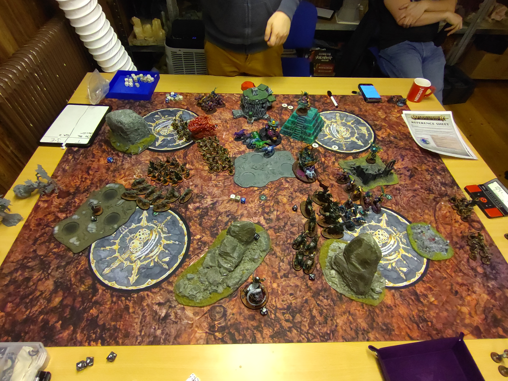
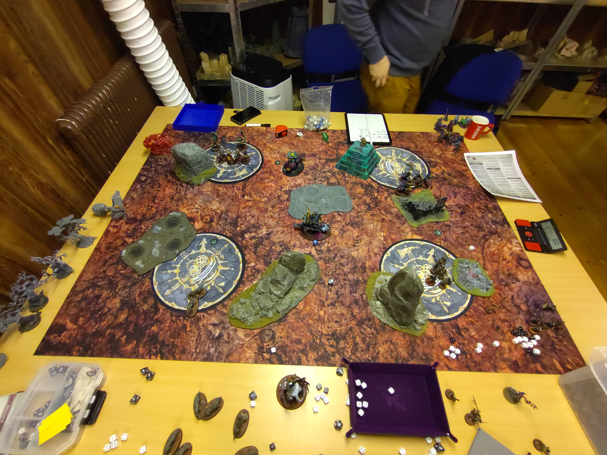

# Soulblight Gravelords vs Seraphon

**SM-Kvalmatch**

## Mission
Path of a Champion

### Resultat
Förlust
19 - 21

### Battle Tactics / Grand Strategies

**Soulblight Gravelords**

Grand Strategy

Vampiric Conquerors (Misslyckades) (Soulblight Gravelords)

Battle Tactics

1) Gaining Momentun (Misslyckades)
2) Eye for an Eye (Lyckades)
3) Cunning Manoeuvre (Lyckades) 
4) Desecrate Their Lands (Lyckades)
5) Unstoppable Armies (Misslyckades) (Soulblight Gravelords)

**Seraphon**

Grand Strategy

Take What’s Theirs (Misslyckades)

Battle Tactics

1) Cunning Manoeuvre (Misslyckades)
2) Desecrate Their Lands (Lyckades) + Gaining Momentun ( Misslyckades) 
3) United Offence (Lyckades)
4) Eye for an Eye (Lyckades)
5)  --

## Terräng

Terrängsetup med hjälp av [Terrängspelet](../../../SM/terr%C3%A4ngspelet.md). Kommer att använda väderstrecken och jag har deployat i söder. Får se om jag kan komma på något bättre sätt att benämna spelbrädet, men behöver något för att kunna beskriva saker.

## Gravesites
Vart en bra deployment av Gravesites, bra täckning för wardsaven och bra grave deployment möjligheter. Det enda jag missade vart att verkligen mäta så att jag fick wardsave utan karaktärer på hela mitten objektivet. Känndes som att Grave sites täckte upp alla möjligheter vid objektiv explosionen i runda 3.

## Deployment

Vet inte riktit hur jag skulle deployat här. Tror det vart fel att ha mina 20a Grave Guards i Graven. Skulle antagligen haft mina Zombies där istället och sen droppat mina ett av mina sett med skelett för att ta mitten objektivet första rundan. 

Följade deployade i graven
* Zombies x40
* Grave Guards 2h x10
* 2x Deathrattle Skeletons x10

## Listor

* [Soulblight Gravelords](soulblight-lista-2023-01-29.pdf)
* [Seraphon](seraphon-lista-2023-01-29.md)

## Battle

### Round 1

#### Top - Seraphon

**Hero Phase**

**Heroic Actions**

Vampire Lord
- Heroic Leadership (Misslyckades)

Slann
- Heroic Leadership (Misslyckades)

Skink Starpriest
- Serpent Staff (Bastilladon)

Skink Priest
- Star-stone Staff (Lyckades) (Bastilladon)

**Spells**

Slann
- Comet's Call
- Stellar Tempest
- --

Skink Starpriest
- Hand of Glory

Realmshaper Engine
- Power Unleashed (Vampire Lord dör av Comet's Call + Power Unleashed)

**Prayers**

--

**Movement**

Saurus Knights#1 avancerar mot sydöstra objektivet tätt följda av Skink Starpriest.
Saurus Knights#2 smyger fran mot nordvästra objektivet.
Saurus Astrolith Bearer föjler efter Skink Starpriest för att upprätthålla 6+ ward auran

**Shooting**

Bastilladon skjuter in i Blood Knights x2, dödar 4 Totalt
Engine of the Gods summonar 10 Saurusar

**Charge**
 
 --

**Fight**

--

**Battleshock**

--

***Skink Starpriest sluga manöver ger Seraphon  5VP***

#### Bottom - Soulblight Gravelords

**Hero Phase**

**Heroic Actions**

Necromancer
- Heroic Leadership (Lyckades)
- Heroic Recovery (Lyckades)

Slann
 - Heroic Leadership (Lyckades)

**Spells**

Necromancer
- Vanhels Danse Macabre (Unbound)

Vengorian Lord
- Amethystine Pinions (Unbound)

**Movement**
20 Grave Guards avancerar mot mitten
Dire Wolves följer efter
Blood Knights avancerar mot sydöstra objektivet
Black Knights avancerar mot sydöstra objektivet
Vengorian lord avancerar mot sydöstra objektivet

40 Zombies droppar precis vid nordvästra objektivet
10 Skelett droppar på nordvästra objektivet
10 Skelett droppar vid sydvästra objektivet
10 Grave Guards droppar vid sydvästra objektivet

**Charge**
Zombies misslyckas med charge 
10 Grave Guards misslyckas med charge 
10 Skelett misslyckas med charge 
Black Knights misslyckas med charge 
Vengorian Lord misslyckas med charge 
Blood Knights lyckas med charge

**Fight**
Blood Knights dödar 4 Saurus Warriors

**Battleshock**

--

***Vampyrerna får inget moment i matchen och tar  2VP***

### Round 2

#### Top - Seraphon

**Hero Phase**

**Heroic Actions**

Engine of the Gods
- Their Finest Hour

Vengorian Lord
- Heroic Leadership (Lyckades)

Skink Starpriest
- Serpent Staff (Engine of the Gods)

Skink Priest
- Star-stone Staff (Lyckades) (Bastilladon)

**Spells**

Slann
- Comet's Call
- Stellar Tempest

Skink Starpriest
- Hand of Glory

**Prayers**

Engine of the Gods
- Curse

**Movement**

Saurus Knights#2 förbereder en charge vid nordvästra objektivet
Engine of the Gods förbereder en charge mot Blood Knights
Saurus Knights#3 flyttar upp screnen för att skydda Bastilladonen

Ravanaks äter upp 8 Zombies

**Shooting**

Bastilladonen skjuter 2x in i Zombies, dödar 22st
Engine of the Gods gör MWs, dödar 2 Zombies, 2 grave guards och skadar en Blood Knight
Astrolith Bearer dödar 2 grave guards med Fusil of Conflagration

**Charge**

Engine of the Gods Chargear Blood Knights
Saurus Knights#2 chargear Skeletten på nordvästra objektivet 

**Fight**
Engine of the Gods dödar 4st Blood Knigts
Blood Knights dödar 2st Saurus Warriors
Saurus Knights#2 dödar 2st Skelett
Skeletten dödar en Saurus Knight

**Battleshock**

Resterade Zombies flyr fältet

20 Zombies återuppstår via Endless Legions

***Seraphon får inget moment i matchen, men de vanhelgar skogen i mitten och tar 5VP***

#### Bottom - Soulblight Gravelords

**Hero Phase**

**Heroic Actions**

Vengorian Lord
- Heroic Leadership (Lyckades)

**Spells**

Vengorian Lord
- Amethystine Pinions (Unbound)

Necromancer
- Vanhels Danse Macabre (Unbound)

**Movement**

20 Grave Guards flyttar upp för en charge
Skelett retriterar från Saurus Knights#2
20 Zombies flyttar fram för en charge
skeletten vid sydöstra objektivet går mot objektivet
10 Grave Guards rör sig mot Astrolith Bearer
Vengorain Lord förbereder en charge
Black Knights förbereder en charge
Dire Wolves springer mot mitten

**Charge**

- 20 Grave Guards chargear Saurus Knigts#3 med Forward to Victory
- - Bastilladon gör Unleash Hell men dödar bara 1 Grave Guard
- 10 Grave Guards Misslyckas med chargen
- 10 Skelett misslyckas med chargen
- 20 Zombies lyckas med chargen in i Engine of the Gods
- Vengorian lord lyckas chargea engine of the Gods
- Black Knigts lyckas med chargen och når Skink Starpries

Vengorian lord skriker på Engine of the Gods
Engine of the Gods försöker skrika tillbaka men misslyckas

**Fight**

20 Grave Guards dödar Saurus Knights#3
Saurus Warriors gör 1 skada på Black Knights
Zombies gör 3MWs på Engine of the Gods
Blood Knights dödar 2 Saurus Warriors
Engine of the Gods dödar Blood Knights
Vengorian Lord gör 3skada på Engine of the gods
Skink Starpriest gör 1 skada på Black Kngihts
Black Knights gör 2 skada på Skink Starpriest och dödar en Saurus warrior

**Battleshock**

--

***Öga för öga så tar Vampyrerna  4VP***

### Round 3

#### Top - Soulblight Gravelords

**Hero Phase**

**Heroic Actions**

Vengorian Lord
- Heroic Leadership (Lyckades)

Slann 
- Heroic Leadership (Misslyckades)

**Spells**

Vengorian Lord
- Mystic Shield (Unbound)

Necromancer 
- Arcane Bolt (Unbound)

**Movement**
20 Grave Guards förbereder en charge mot Realm Shaper Engine
Dire Wolves förbereder en charge mot Bastilladonen
6 Grave Guards förbereder en charge mot Astrolith Bearer
Skelett vid sydöstra objektivet springer in på objektivet

Necromancer använder Tunnel Master och lägger in lilltån på sydöstra objektivet

**Charge**

Dire Wolves chargear Bastilladonen, 2 vargar dör på Unleash
20 Grave Guards lyckas med chargen på Realmshaper Engine
6 Grave Guards chargear Astrolith Bearer

**Fight**
20 Grave Guards dödar Slann
Engine of the Gods dödar 8 Zombies
6 Grave Guards gör 3 skada på Astrolith Bearer 
Astrolith Bearer dödar 2 Grave Guards
Vengorian Lord gör 3skada på Engine of the Gods
Zombies gör 3MWs på Engine of the Gods
Black Knigts dödar Skink Starpriest och Sista Saurus warriorn

**Battleshock**

--

***Necromancerns sluga manöver ger Vampyrerna  5VP***

#### Bottom - Seraphon

**Hero Phase**

**Heroic Actions**

Vengorian Lord
- Their Finest Hour

Skink Priest
- Heroic Leadership (Lyckades)

Skink Priest
- Star-stone Staff (Lyckades) (Bastilladon)

**Prayers**

Skink Priest
- Heal (Lyckades) (Engine of the Gods)

Enigne of the Gods
- Curse (Lyckades) (Vengorian Lord)

**Movement**
Saurus Knights#1 förbereder en charge mot 20 Grave Guards

Celestant Prime droppar från Himlen

**Shooting**
Bastilladon Skjuter två gånger in i 20 Grave Guards, dödar 14
Engine of the Gods healar 

**Charge**
Saurus Knights#1 chargear 20 Grave Guards
Saurus Knights#2 chargear skeletten på nordvästra objektivet
Celestant Prime chargear Vengorian Lord

Vengorian Lord trampar på Celestant Prime
Engine of the Gods försöker skrika på Vengorian Lord men misslyckas
Bastilladon stampar på 20 Grave Guards, dödar 1

**Fight**
Saurus Knights#1 dödar resterande 20 Grave Guards
Vengorian Lord dödar Celestant Prime
Engine of the Gods gör ingen skada på Vengorian Lord
4 Grave Guards gör 2 skada på Astrolith Bearer
Saurus Knights#2 dödar 3 Skelett på nordvästra objektivet
Bastilladonen dödar Vargarna
Astrolith Bearer dödar 2 Grave Guards

**Battleshock**

10 Grave Guards återuppstår via Endless Legions 9" från Astrolith Bearer

***Efter en enad offensiv så tar Astrolith Bearer och Skinkpriest  4VP***

### Round 4

#### Top - Seraphon

**Hero Phase**

**Heroic Actions**

Vengorian Lord
- Heroic Leadership (Lyckades)

Skink Priest
- Heroic Leadership (Lyckades)

Skink Priest
- Star-stone staff (Lyckades) (Bastilladon)

**Spells**

Vengorian Lord
- Dispellar Ravanaks

**Prayers**

Skink Priest
- Heal (Lyckades) (Engine of the Gods)

Engine of the Gods
- Curse (Lyckades) (Vengorian Lord)

**Movement**

Saurus Knights#1 förbereder en charge mot Grave Guards

**Shooting**
Saurus Knights#1 Chargear Grave Guards
Bastilladonen skjuter två gånger på Vengorian Lord och dödar honom
Engine of the Gods Healar

**Charge**

Engine of the Gods chargear Black Kngihts
Skink priest skjuter på sista grave guarden i 10 enheten, och dödar den

**Fight**
Engine of the gods dödar Black Knights
Saurus Knights#2 dödar Skeletten på nordvästra objektivet

**Battleshock**

***Öga för Öga så tar Ödlorna  5VP***

#### Bottom - Soulblight Gravelords

**Hero Phase**

**Heroic Actions**

Necromancer
- Heroic Leadership (Lyckades)

Skink Priest
- Heroic Willpower

**Spells**

Necromancer
- Arcane Bolt (Misslyckas)

**Movement**
Skeletten vid sydöstra objektivet använder At the Double springer mot terrängen i Seraphons zon

**Charge**
10 Grave Guards chargear Astrolith Bearer

**Fight**
10 Grave Guards dödar Astrolith Bearer

**Battleshock**

5 Vargar återuppstår på Soulblights hemma objektiv via Endless Legions

***Skeletten vanhelgar Terröngen och vampyrerna tar 5VP***

### Round 5

#### Top - Soulblight Gravelords

**Hero Phase**

**Heroic Actions**

Necromancer
- Heroic Leadership Lyckades)

Skink Priest
- Heroic Leadership (Lyckades)

**Spells**

Necromancer
- Arcane Bolt (Misslyckades)

**Movement**
Dire Wolves använder At the Double och kommer precis fram till de nordvästra objektivet

**Charge**

--

**Fight**

--

**Battleshock**

--

***Vampyrerna vart inte så ostoppbara som de trodde och tar 3VP***

#### Bottom - Seraphon

**Hero Phase**

**Heroic Actions**

Necromancer
- Heroic Leadership Lyckades)

Skink Priest
- Heroic Leadership (Lyckades)

**Movement**
Engine of the Gods använder At the Double för att ta en grave site
Bastilladon går och tar en annan grave site

**Shooting**
Bastilladonen Skjuter två gånger in i Dire Wolves och dödar dem

**Charge**
 
 --

**Fight**

--

**Battleshock**

--

***Ödlorna håller 2 objektiv och tar precis  2VP***

