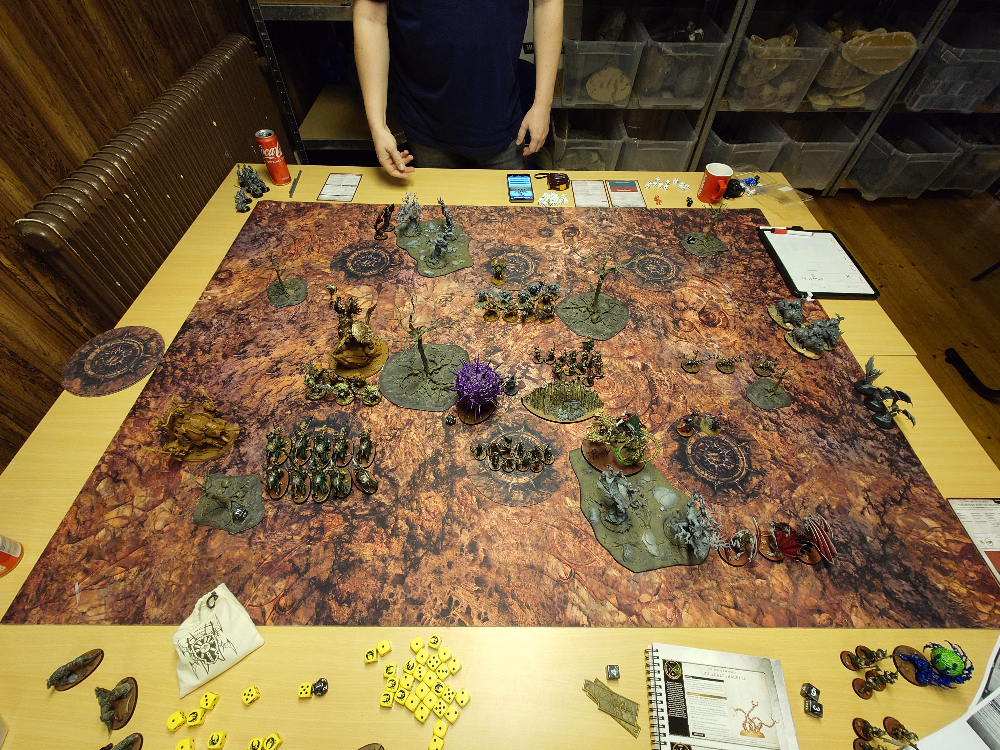

# SBG vs IronJaws

## Mission

GBH 2024-2025

The Better Part of Valour

### Resultat
Vinst

### Battle Tactics och Poäng

| | JonE (SBG) | Joel (IJ) |
|---|---|---
|T1|Take The Flanks (8)|Get Stuck in (8)|
|T2|Take Their Land (10)| - (6)|
|T3|- (6)|Attack on Two Fronts (8)|
|T4|Inevetable Demise( 10)| Slay the Entourage (6)|
|T5|Seize the Center (10)|Take Their Land (6)|
|Totalt| 44|34|

## Terräng

Enligt terrängkartan i GHB:n Bild från slutet av Battle round  ett 

## Deployment

Tycker att deploymenten vart helt ok. Mina endless spells vart chargeade tur ett, samt mina dire wolves. Men de skyddade mina black knights. Svårt att hindra en tur ett 3D6 charge.

## Battle

Tyckte matchen gick förvånansvärt bra för att vara första matchen sen Oktober 2023 samt första i AoS4. Taktiskt vet jag inte om jag hade kunnat skydda mig bättre. Hade mina vargar som skydd framför mina black knights, men iom dubbeltur så fick de inte chargea och black knight utan charge vart ju inte lysande. Men å andra sidan så ska man ju dö med saker i SBG iom att man betalar för +50% av enhetsstorleken. Mina fladdemöss tog en T1 battle tactic och sen kom båda enheterna tillbaka och tog ett par objectives. 

Mina grave guards vart riktigt trevliga, en counter charge i tur ett och de lyckades städa ganska bra bland 'ard boysen. Sen i T2 så failade Brutsen chargen på dubbel 1 och reroll vart använd för att få in ragers i mina skelett. Där känns de som att matchen vände helt, för när de vart min tur så gjorde jag 17dmg på min charge och sen 8 till på andra fighten (från necromancern). De hade fått fights last från spellen Prison of Greif. Dock failade Manfred counter chargen så tog en tur extra att städa upp från ragers. Mina vargheists teleporterade till nord östra hörnet och tog take their lands enkelt.

Tog en Dubbel in i T3 och lyckades städa upp ganska bra. Dödade de sista brutesen och försökte screena objectives från grisar och arga destruction gudar. De vart en riktig slog på östra kanten mellan gore gruntas, mina bats, min vampire lord och sen 5st fräsha black knights.

Tur 4 vann jag roll offen och behöll turn order. Inevetable demise klarades enkelt med då de mesta i min arme vart på andra sidan bordet och det fanns inte så mycket kvar där. Dödade war chantern så det vart bara Kragnos och Mawgrunta kvar. Tappade Manfred till Kragnos, men kunde inte riktigt sprigna ifrån en arg gud.

Tur 5 så vart det Kragnos kvar då Mawgrunta dog på clap back från grave guards efter att ha missat alla attcker mer eller mindre. Tog en enkel Seize the center och hold 1,2,more.

## Listan och armén

Tycker att listan funkade rätt ok, känndes som att det vart en ganska representativ SBG lista. Ska spela den mer utan egentliga ändringar för att komma in mer i spelet. Så slipper jag försöka lära mig nya units i varje match.

Bra mix av enheter, både black knigts och grave guards känns som att de har lite killing power. Sen har man bra objecive control med skelett, fladdermöss och vargheists kombinerat med endless legions. Gillar verkligen att den är 1CP istället för en roll som de vart i AoS3. Känns som att spelstilen verkligen är rätt för mig, lite tricks och inte så mycket kötta ner motståndar armén. Hade ju dock varit lite kul om vampyrerna varit lite mer punchy. Nu känns de mer som buff grejer för alla deras minions. Kanske ska försöka att alltid ha en CP för att ge manfred All-out-attack för att han ska vara lite mer pålitlig. 

Necromancern vart helt otroligt bra, speciellt tillsammans med Grave Guardsen. Piskan för att få lite fart på dem och sen dubbel fight med chans att ge motståndaren fights last via Prison of Greif spellen.

Sen gillade jag att ha endless spells, riktigt trevligt att kunna summona in dem och hade galen tur i 1:a rundan och fick ut alla 4! Känndes bra att ha 4st casts i armén.

## Notes

Väderstrecken är utifrån mig, så jag spelar på södra kanten.